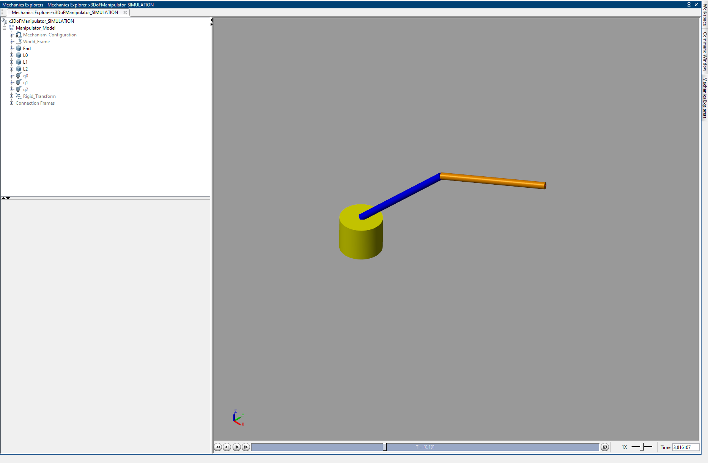
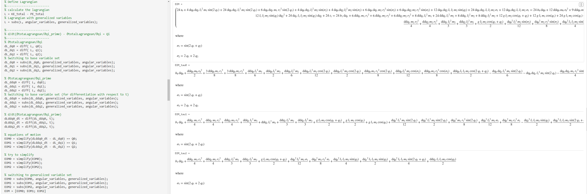
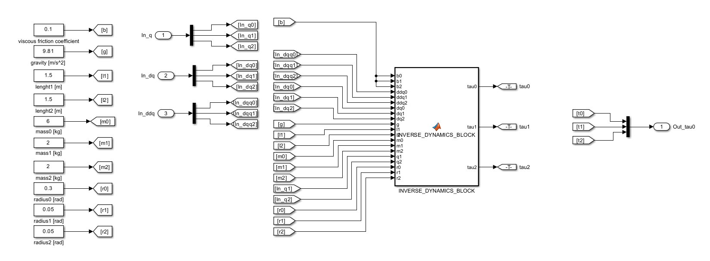

## Required Resources and Execution Details

To run the MATLAB files, the following extensions must be installed:
* **MATLAB R2023b**
* **Simscape**
* **Simscape Multibody**
* **Simulink**
* **Robotic System Toolbox**
* **Symbolic Math Toolbox**

> [!IMPORTANT]
> Before opening the `3dof_manipulator_simulation.srx` file, you **must** execute the `3dof_dynamics_calculation.mlx` file. This ensures the robot tree is loaded and the trajectory is stored in the workspace.

---

## Notable Reference

A particularly noteworthy resource should be highlighted: the video series by **The MathWorks, Inc.**, titled **"Teaching Rigid Body Dynamics."**

The series, specifically **"Part 3: Two-Degrees-of-Freedom Non-Planar Robotic Manipulator Case Study,"** served as an essential guideline for this project. The relevance of this series stems from its direct overlap with the project's objective: calculating the dynamics of a spatial manipulator. Consequently, many sections of this project are based on the concepts presented in the series and have partially adapted them.

## Symbolic Expressions

In the further course of this project, the evaluation of symbolic mathematical expressions will be required. For this purpose, the **Symbolic Math Toolbox** serves as an ideal addition to MATLAB. This toolbox provides functions for differential equations, equation simplification, and equation manipulation. Another essential advantage of this toolbox is the ability to generate **Simulink Function Blocks** directly from symbolic expressions (The MathWorks, n.d.).

### Methodology and Variable Definition

The process begins by defining all relevant static variables, including:
* **Dimensions** (Measurements)
* **Masses**
* **Gravitational Constant** (Approximation)
* **Friction Coefficients**

Subsequently, time-dependent variables such as **torque** and **joint angles**, along with their corresponding generalized variables, are specified and organized in a **substitution matrix**. This setup allows for seamless switching between time-dependent and generalized coordinates using the `subs` function during the later stages of the project.

# Modeling of a three link manipulator

## Inverse Dynamics
Using **inverse dynamics** to determined the torques which are required to manipulate the multi-body system so that the desired joint angles are achieved. Within the scope of this project, these torques are applied as a **load torque** ($\tau_l$) to the actuators. For this calculation, the **Lagrange formulation** is utilized. The advantage of this formulation lies in the fact that the equations of motion can be calculated using a systematic computational procedure (Siciliano et al., 2009, p. 248).

The Lagrangian ($\mathcal{L}$) is derived from the difference between the **kinetic energy** ($T$) and the **potential energy** ($U$):

$$\mathcal{L} = T - U$$

The equations of motion are then derived using the Euler-Lagrange equation If non-conservative forces $\epsilon_i$ (such as frictional forces) are present between the joints, the equation is defined as follows:

$$\frac{d}{dt} \left( \frac{\partial \mathcal{L}}{\partial \dot{q}_i} \right) - \frac{\partial \mathcal{L}}{\partial q_i} = \epsilon_i$$

Where:
* $q_i$: Joint positions
* $\dot{q}_i$: Joint velocities
* $\epsilon_i$: Generalized forces/torques

## Kinetic Energy $T$
The kinetic energy of a rigid body is the sum of the translational energy $T_{trans}$ and the rotational energy $T_{rot}$. The translational energy of a mass point is proportional to its mass $m$ and the square of its linear velocity $\vec{v}$ (Wikipedia, 2023):

$$T_{trans} = \frac{1}{2} m \vec{v}^T \vec{v}$$

$$T_{v} = \frac{1}{2} m (\dot{x}^2 + \dot{y}^2 + \dot{z}^2)$$

This means that the Cartesian coordinates for each individual mass position must first be defined, differentiated, and squared to determine the linear velocity.

The rotational energy is derived from the inertia tensor $I$ and the angular velocity $\vec{\omega}$ squared (Wikipedia, 2022):

$$T_{rot} = \frac{1}{2} \vec{\omega}^T I_{inertia} \vec{\omega}$$

The **inertia tensor** is a $3 \times 3$ symmetric matrix containing the mass moments of inertia on its diagonal and the products of inertia on its off-diagonal elements (Kasadin & Paley, 2011, p. 481). For the manipulator discussed here, complex shapes are avoided, and a **solid cylinder** is assumed for all three bodies. The corresponding inertia tensor matrix can be obtained from standard tables.

It is crucial to note that the elements of the inertia matrix are defined in the **local frame** of the respective body. Therefore, to ensure that the inertia matrix remains independent of the manipulator configuration, the angular velocity must be referenced to the body's local frame.

If the joints have been defined using the **Denavit-Hartenberg (D-H) convention**, the angular velocity can be transformed using the transposed rotation matrix $R_i$ from Link $i$ to Link $i-1$ (Siciliano et al., 2009, p. 251):

$$\omega_{i-1} = R_i^T \omega_i$$

The total kinetic energy is then calculated as the sum of translational and rotational components:

$$T = T_{trans} + T_{rot}$$

## Potential Energy $U$
The final component required for the Lagrange formulation is the potential energy. If spring energy is neglected, the potential energy corresponds to the gravitational potential energy (Wikipedia, 2023):

$$U = mgh$$

The heights $h$ are derived from the position vectors of the masses, specifically from the $z$-components (in the world coordinate system).

## Generalized Forces
The generalized force $\epsilon$ is derived from the contributions of the actuation torque $\tau$ at the joint and the viscous friction torques (Siciliano et al., 2009, p. 249):

$$\epsilon = \tau - b \dot{\theta}$$

## Trajectory Planning

For trajectory planning, a simple **trapezoidal velocity profile** is utilized. In this project, a position matrix for the end-effector is defined, and the corresponding joint angles are determined using `robotics.InverseKinematics(...)` and stored in a matrix.

> [!NOTE]
> The robot's geometry was manually redefined using the **Robotic System Toolbox**. This step was necessary because importing the model via the `.slx` file did not function as expected.

A trapezoidal profile is generated using the MATLAB function `trapveltraj`. This function requires the joint angle matrix, the number of samples, and the peak velocity. The minimum peak velocity is calculated as follows:

$$v_{peak, min} = \frac{\Delta\theta_{max}}{t}$$

where $\Delta\theta_{max}$ corresponds to the highest angular change of the joints. The `trapveltraj` function returns three matrices regarding **position, velocity, and acceleration** (MathWorks, n.d.). After defining the required time span of 10 seconds, these matrices are plotted for visualization and converted into `timeseries` objects for use within Simulink.

## Implementation in MATLAB and Simulink

A **MATLAB Function Block** is created to handle the dynamics. It accepts all required variables (e.g., dimensions, masses, angles) as inputs and outputs the calculated torques (MathWorks, n.d.).

### Simulink Integration
This block is integrated into a Simulink model where the necessary variables are defined:
* **Static Variables:** Defined using `Constant` blocks.
* **Dynamic Variables:** Time-series data for joint positions and their derivatives are imported via `From Workspace` blocks.
* **Core Logic:** The equations derived in Chapter 2.4 are contained within the generated `INVERSE_DYNAMICS_BLOCK`, which outputs the calculated torque.

### Simscape Multibody Modeling
The physical model is developed using **Simscape Multibody**:
* **Joint 0:** Aligned with the World Coordinate System.
* **Subsequent Joints:** Aligned according to **DH Conventions** using Simscape `Rigid Transform` blocks.
* **Joint Parameters:** Configured uniformly to accept torque as input and provide position as output.
* **Bodies:** Modeled as `Cylindrical Solid` elements with corresponding physical parameters.

### Solver and Analysis
The simulation uses a **Variable-Step solver** with the `ode45` algorithm. For visual representation and system analysis, `Scopes` were incorporated to monitor:
1. Trajectories
2. Calculated Torques
3. Actual Positions (Actual vs. Target)

Additional scopes are located within the subsystems for granular data tracking.

---

## References

* **Kasdin, N. J. & Paley, D. A. (2011).** *Engineering Dynamics: A Comprehensive Introduction*. Princeton University Press. ISBN 978-0-691-13537-3.
* **Siciliano, B., Sciavicco, L., Villani, L., & Oriolo, G. (2009).** *Robotics: Modelling, Planning and Control*. Springer-Verlag London Limited. [DOI: 10.1007/978-1-84628-642-1](https://doi.org/10.1007/978-1-84628-642-1)
* **The MathWorks, Inc. (n.d.).** *Teaching Rigid Body Dynamics. Part 3: Two-Degrees-of-Freedom Non-Planar Robotic Manipulator Case Study*. [Video Link](https://de.mathworks.com/videos/teaching-rigid-body-dynamics-part-3-two-degrees-of-freedom-non-planar-robotic-manipulator-case-study-1509356325784.html)
* **The MathWorks, Inc. (n.d.).** *Design Trajectory with Velocity Limits Using Trapezoidal Velocity Profile*. [Documentation](https://de.mathworks.com/help/robotics/ug/design-a-trajectory-with-velocity-limits-using-a-trapezoidal-velocity-profile.html)
* **The MathWorks, Inc. (n.d.).** *Robotics System Toolbox: Design, simulate, test, and deploy robotics applications*. [Product Page](https://de.mathworks.com/products/robotics.html)
* **The MathWorks, Inc. (n.d.).** *Symbolic Math Toolbox: Perform symbolic math computations*. [Product Page](https://de.mathworks.com/products/symbolic.html)
* **The MathWorks, Inc. (n.d.).** *timeseries: Create timeseries object*. [Reference](https://de.mathworks.com/help/matlab/ref/timeseries.html)
* **Wikimedia Foundation Inc. (2023).** *Kinetische Energie* (Kinetic Energy). [Source](https://de.wikipedia.org/wiki/Kinetische_Energie)
* **Wikimedia Foundation Inc. (2023).** *Liste von Trägheitstensoren* (List of Moments of Inertia). [Source](https://de.wikipedia.org/wiki/Liste_von_Tr%C3%A4gheitstensoren)
* **Wikimedia Foundation Inc. (2023).** *Potentielle Energie* (Potential Energy). [Source](https://de.wikipedia.org/wiki/Potentielle_Energie)
* **Wikimedia Foundation Inc. (2022).** *Rotationsenergie* (Rotational Energy). [Source](https://de.wikipedia.org/wiki/Rotationsenergie)
